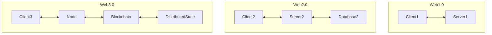

  <h2>목차</h2>
    <a href="https://devjzen.github.io/web3/2025/07/19/%EB%B8%94%EB%A1%9D%EC%B2%B4%EC%9D%B8-%EC%BD%94%EC%96%B4-%EA%B0%9C%EB%B0%9C.html">
      Part 1. 블록체인 코어 개발에 대해서
    </a> 
    <a href="https://devjzen.github.io/web3/2025/07/19/%EB%B8%94%EB%A1%9D%EC%B2%B4%EC%9D%B8-%EC%BD%94%EC%96%B4-%EA%B0%9C%EB%B0%9C.html#h-chapter-1-%EB%B8%94%EB%A1%9D%EC%B2%B4%EC%9D%B8%EC%9D%B4-%ED%95%B4%EA%B2%B0%ED%95%98%EB%8A%94-%EB%AC%B8%EC%A0%9C">
      Chapter 1. 블록체인이 해결하는 문제
    </a> 
    <a href="https://devjzen.github.io/web3/2025/07/19/%EB%B8%94%EB%A1%9D%EC%B2%B4%EC%9D%B8.html">
      1-1. 블록체인
    </a>
    <a href="https://devjzen.github.io/web3/2025/07/19/%EB%B8%94%EB%A1%9D%EC%B2%B4%EC%9D%B8-%EC%BD%94%EC%96%B4-%EA%B0%9C%EB%B0%9C.html#h-chapter-2-%EB%B8%94%EB%A1%9D%EC%B2%B4%EC%9D%B8-%EC%95%84%ED%82%A4%ED%85%8D%EC%B3%90">
      Chapter 2. 블록체인 아키텍쳐
    </a> 
    <a href="https://devjzen.github.io/web3/2025/07/21/%EB%84%A4%ED%8A%B8%EC%9B%8C%ED%82%B9.html">2-1. 네트워킹</a> 
    <a href="https://devjzen.github.io/web3/2025/07/28/2-%ED%95%A9%EC%9D%98.html">2-2. 합의</a> 
    <a href="https://devjzen.github.io/web3/2025/07/29/2-%EB%8D%B0%EC%9D%B4%ED%84%B0.html">2-3. 데이터</a> 
    <a href="https://devjzen.github.io/web3/2025/07/29/2-%EC%8B%A4%ED%96%89.html">2-4. 실행</a> 
    <a href="https://devjzen.github.io/web3/2025/07/29/2-%EC%95%A0%ED%94%8C%EB%A6%AC%EC%BC%80%EC%9D%B4%EC%85%98.html">2-5. 애플리케이션</a> 
    <a href="https://devjzen.github.io/web3/2025/07/19/%EB%B8%94%EB%A1%9D%EC%B2%B4%EC%9D%B8-%EC%BD%94%EC%96%B4-%EA%B0%9C%EB%B0%9C.html#h-chapter-3-%EB%B8%94%EB%A1%9D%EC%B2%B4%EC%9D%B8-%EC%95%94%ED%98%B8%ED%95%99">
      Chapter 3. 블록체인 암호학
    </a> 
    <a href="https://devjzen.github.io/web3/2025/07/29/3-%ED%95%B4%EC%8B%9C%ED%95%A8%EC%88%98.html">3-1. 해시함수</a> 
    <a href="https://devjzen.github.io/web3/2025/07/30/%EB%94%94%EC%A7%80%ED%84%B8-%EC%84%9C%EB%AA%85.html">3-2. 디지털 서명</a> 
    <a href="https://devjzen.github.io/web3/2025/07/29/3-%EB%A8%B8%ED%81%B4%ED%8A%B8%EB%A6%AC.html">3-3. 머클트리</a> 
    <a href="https://devjzen.github.io/web3/2025/07/19/%EB%B8%94%EB%A1%9D%EC%B2%B4%EC%9D%B8-%EC%BD%94%EC%96%B4-%EA%B0%9C%EB%B0%9C.html#h-chapter-4-%EB%B8%94%EB%A1%9D%EC%B2%B4%EC%9D%B8-%EB%B6%84%EC%82%B0-%EC%8B%9C%EC%8A%A4%ED%85%9C">
      Chapter 4. 블록체인 분산시스템
    </a> 
    <a href="https://devjzen.github.io/web3/2025/07/29/4-CAP%EC%A0%95%EB%A6%AC%EC%99%80-%EB%B8%94%EB%A1%9D%EC%B2%B4%EC%9D%B8.html">4-1. CAP정리와 블록체인</a> 
    <a href="https://devjzen.github.io/web3/2025/07/29/4-%EB%B9%84%EC%9E%94%ED%8B%B4-%EA%B2%B0%ED%95%A8-%ED%97%88%EC%9A%A9.html">4-2. 비잔틴 결함 허용(BFT)</a> 
  

    <a href="https://devjzen.github.io/web3/2025/07/29/5-Cosmos-SDK.html">
    Part 2. Cosmos SDK
    </a> 
    <a href="https://devjzen.github.io/web3/2025/07/29/5-Cosmos-SDK.html#h-chapter-1-cosmos-%EC%86%8C%EA%B0%9C">
      Chapter 1. Cosmos 소개
    </a> 
    <a href="#">1-1. CometBFT</a> 
    <a href="#">1-2. Cosmos SDK</a> 
    <a href="#">1-3. Cosmos EVM</a> 
    <a href="https://devjzen.github.io/web3/2025/07/31/IBC.html">1-4. IBC</a> 
  <a href="https://devjzen.github.io/web3/2025/07/29/5-Cosmos-SDK.html#h-chapter-2-evm-%EA%B5%AC%ED%98%84%EC%B2%B4">
      Chapter 2. EVM 구현체
  </a> 
    <a href="https://devjzen.github.io/web3/2025/07/29/5-Cosmos-SDK.html#h-chapter-3-cometbft-consensus">
      Chapter 3. CometBFT Consensus
    </a> 
    <a href="https://devjzen.github.io/web3/2025/07/31/%EC%B5%9C%EC%8B%A0-BFT-%ED%94%84%EB%A1%9C%ED%86%A0%EC%BD%9C.html">3-1. 최신 BFT 프로토콜</a> 
    <a href="#">3-2. CometBFT의 개선점</a> 
  
  

## 왜 블록체인 분야에서 많은 인재를 원할까?

코로나 이후, 개인의 삶이 전보다 복잡해졌습니다. 저성장과 고성장으로 뚜렷한 양극화 현상이 발생하고 보이지 않는 격차를 만들어내고 있습니다. AI의 등장으로 인하여 직업과 노동에 변화가 생겼습니다. 보다 더 나은 보건과 행정이 제공되며 수명이 연장됨에 따라서 생애주기도 달라졌죠. 지구의 자전축이 기울어졌다는 연구결과도 있으며 기후변화가 관측되기도 합니다. 그리고 세상은 암호화폐라는 가치를 직면했습니다.

처음에 사람들은 암호화폐를 인정하고 싶지 않았을 겁니다. 기존의 시스템에 저항하는 형태의 가치가 등장한 것과 같으니까요. 그런데 생각해보면 화폐는 곡식과 천, 금덩이, 소금 다양한 형태로 존재했고 편의에 따라서 꾸준히 발전해왔습니다. 이미 등장한 가치에 대해서 많은 사람들이 인정하고 사용하고 있어서, 인정하고 싶지 않던 사람도 이제는 어떻게 사용할 것인가에 대하여 고민하게 될 것입니다. 그리고 블록체인은 지금처럼 복잡해진 세상에서 신뢰의 문제를 해결해줄 기술로 자리잡게 될 것입니다.

암호화폐는 블록체인이라는 기술로 등장했습니다. '은행을 믿을 수 없다면 뭘 믿어야 할까? 그리고 어떻게 믿어야 할까?' 의 관점에서 등장한 기술은 단순히 화폐의 가치를 넘어서서 '권한'과 '소유'의 개념에 대해서 다시 정의하려고 합니다. 왜냐면, 분산 시스템으로 블록체인 기술이 구현되었거든요!

탈중앙화, 비트코인, 거래소, 해킹까지. 언론을 뒤덮은 암호화폐와 관련된 키워드는 긍정적인 이미지가 아닙니다. 흔히 알고 있는 주식보다 해롭다는 것처럼 언론의 소재거리로 사용되기도 하죠. 그래서 기술이 가지고 있는 가치는 외면 받았습니다. 그리고 이 지점에서 '블록체인 분야에서 사람을 원하는 이유'가 발생합니다. 언론이 다루는 블록체인은 '부정적'이고 '상품가치'로써 사용되는데 이 기술은 위치 정보 서비스처럼 정확도와 정밀성이 필요한 작업에 이용되기도 하고, 보안적인 측면에서의 우수성을 보이기도 합니다. 다루는 사람에 따라서 상품이 될 수도 있지만, 미래에 대한 투자가 될 수 있기에 블록체인 분야에서는 더 많은 사람들에게 정보를 공유하려고 합니다.

기술이 뛰어나다고 해도, 사용하지 않으면 발전할 수 없으니까요. 그리고 지금과 같은 초기 시장에는 다양한 아이디어가 필요하기도 합니다. 더 나아가 인문학적인 소양을 기본으로하는 인재들을 양성하려고 하죠.

그러니 블록체인 분야에서 무엇이든 시작하려는 분들은 의심없이 접근했으면 합니다.

처음 접하는 분야에 대한 막연함으로 고민하는 누군가에게 이 글이 도움이 되었으면 합니다.

---

## Chapter 1. [블록체인](https://devjzen.github.io/web3/2025/07/19/%EB%B8%94%EB%A1%9D%EC%B2%B4%EC%9D%B8.html)이 해결하는 문제

- 중앙화된 서버의 한계
- 분산 시스템의 필요성
- 신뢰 없는 환경에서의 합의

### 1.1. 웹2 vs 웹3 아키텍쳐

**Web**은 **World Wide Web**을 뜻하며 인터넷에 연결된 사용자들이 서로의 정보를 공유할 수 있는 공간을 의미한다. Web 1.0 - Web 2.0 - Web 3.0 으로 발전해왔다.

웹1.0은 웹2.0 이전의 웹사이트에 해당한다. 웹 1.0의 기본 개념은 **디렉터리 검색**이다. 모든 자료는 체계적으로 분류되어 있으며, 사용자들은 카테고리를 통해 자료를 검색하게 된다. 대표적인 예시로 1990년대 '야후'가 있다.

웹2.0는 **개방, 참여, 공유**의 정신을 바탕으로 사용자가 직접 정보를 생산하여 쌍방향으로 소통하는 웹 기술을 말한다. 참여형 웹, 소셜 웹으로 불린다. 웹1이 일방적으로 정보를 보여줬다면 웹2는 사용자가 직접 콘텐츠를 생산하여 쌍방향으로 소통할 수 있다. 대표적인 예시로 '페이스북'이 있다.

**웹3.0는 초기에 시맨틱 웹을 의미했으나 지금은 탈중앙화에 초점을 맞춰 성장하고 있으며 '탈중앙화'라는 기술은 블록체인으로 구현되고 있다.**

> [!info] 웹1, 웹2, 웹3?  
> 웹1은 읽기 전용이고  
> 웹2는 읽기-쓰기가 가능하며  
> 웹3는 읽기-쓰기-소유가 가능하다.

### 1.2. 블록체인 코어 개발은 무엇인가?

블록체인 코어 개발자는 블록체인을 개발하며 블록체인 시스템의 아키텍처를 개발하고 유지 관리한다. 프로토콜을 설계하고 보안 패턴을 개발하며, 네트워크를 감독한다.

### 1.3. 블록체인 코어 개발이 왜 필요한 것인가?

비트코인이라는 디지털 화폐로서 블록체인이 개발되었지만 그 후로 이더리움, 솔라나, 모나드 등의 새로운 블록체인이 등장한 것처럼 기존의 성능을 개선시키거나 특화된 용도로 사용하는 등의 발전을 이룰 수 있기에 블록체인 개발은 필요하며 그로 인해 블록체인 코어 개발자에 대한 수요가 항상 존재한다.

단순히 디지털 화폐라는 가치에서 벗어나서 Filecoin, Chainlink, Helium 과 같은 블록체인을 개발할 수도 있으며 기술 혁신으로 새로운 합의 알고리즘을 개발한다던가, ZK 증명, 레이어2, 샤딩, 병렬 처리를 적용시킬 수도 있다. 서로 다른 요구사항과 문제를 해결하는 다양한 체인들이 존재하게 되었으며 특히나 Cosmos는 서로 다른 블록체인들을 연결시켜주는 역할을 한다.

---

## Chapter 2. 블록체인 아키텍쳐

- [네트워킹](https://devjzen.github.io/web3/2025/07/21/%EB%84%A4%ED%8A%B8%EC%9B%8C%ED%82%B9.html)
- [합의](https://devjzen.github.io/web3/2025/07/28/2-%ED%95%A9%EC%9D%98.html)
- [데이터](https://devjzen.github.io/web3/2025/07/29/2-%EB%8D%B0%EC%9D%B4%ED%84%B0.html)
- [실행](https://devjzen.github.io/web3/2025/07/29/2-%EC%8B%A4%ED%96%89.html)
- [애플리케이션](https://devjzen.github.io/web3/2025/07/29/2-%EC%95%A0%ED%94%8C%EB%A6%AC%EC%BC%80%EC%9D%B4%EC%85%98.html)

블록체인 아키텍처 구조는 생성된 네트워크와 설계 방식에 따라 다양하게 달라질 수 있습니다. 학습 목적으로 '블록체인 아키텍쳐'로 통용하여 네트워킹, 합의, 데이터, 실행, 애플리케이션의 다섯 가지 주요 모듈로 나누어 설명한다.

> How to use Blockchain?

1. 어떻게 데이터를 공유할 것인가? - 전파
2. 어떻게 모두가 동의할 것인가? - 순서 정하기
3. 결과를 어떻게 저장하고 관리할 것인가?
4. 무엇을 할 것인가? - 비즈니스 로직
5. Use-Case

---

### Chapter 3. 블록체인 암호학

- [해시 함수](https://devjzen.github.io/web3/2025/07/29/3-%ED%95%B4%EC%8B%9C%ED%95%A8%EC%88%98.html)
- [디지털 서명](https://devjzen.github.io/web3/2025/07/30/%EB%94%94%EC%A7%80%ED%84%B8-%EC%84%9C%EB%AA%85.html)
- [머클 트리](https://devjzen.github.io/web3/2025/07/29/3-%EB%A8%B8%ED%81%B4%ED%8A%B8%EB%A6%AC.html)

---

### Chapter 4. 블록체인 분산 시스템

- [CAP 정리와 블록체인](https://devjzen.github.io/web3/2025/07/29/4-CAP%EC%A0%95%EB%A6%AC%EC%99%80-%EB%B8%94%EB%A1%9D%EC%B2%B4%EC%9D%B8.html)
- [비잔틴 결함 허용 (BFT)](https://devjzen.github.io/web3/2025/07/29/4-%EB%B9%84%EC%9E%94%ED%8B%B4-%EA%B2%B0%ED%95%A8-%ED%97%88%EC%9A%A9.html)

---

참고 문서: [What is Web3?](https://ethereum.org/ko/web3/), [웹3 WiKi](https://ko.wikipedia.org/wiki/%EC%9B%B93), [Solidity](https://docs.soliditylang.org/en/v0.8.12/introduction-to-smart-contracts.html), [블록체인 wiki](https://ko.wikipedia.org/wiki/%EB%B8%94%EB%A1%9D%EC%B2%B4%EC%9D%B8), [Learn Web3](https://learn.metamask.io/ko/overview), [CoinBase](https://www.coinbase.com/learn/crypto-glossary/what-are-layer-3-blockchains-and-what-is-the-difference-with-layer-2-blockchains), [BitTorrent](https://github.com/bittorrent)

참고 문헌: Andrew S. Tanenbaum - Computer Networks, distributed-system, Peer to Peer-Harnessing the Power of Disruptive Technologies, mastering-ethereum, bitcoin-nakamoto, Daniel Drescher-blockchain-basic, ethereum yellow paper, Designing data intensive applications

참고 강의: Coursera, Ackee - Solana School
