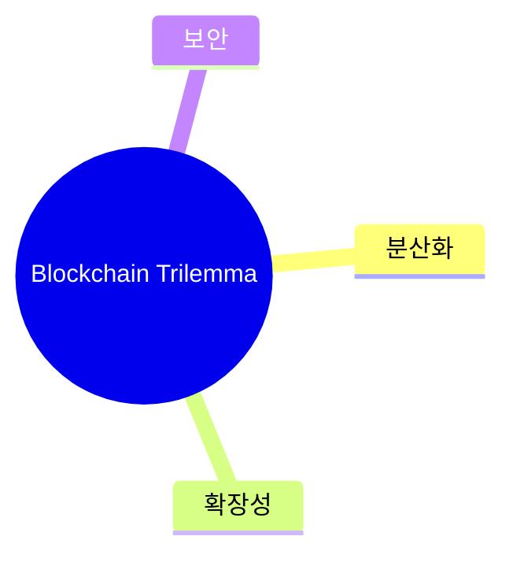
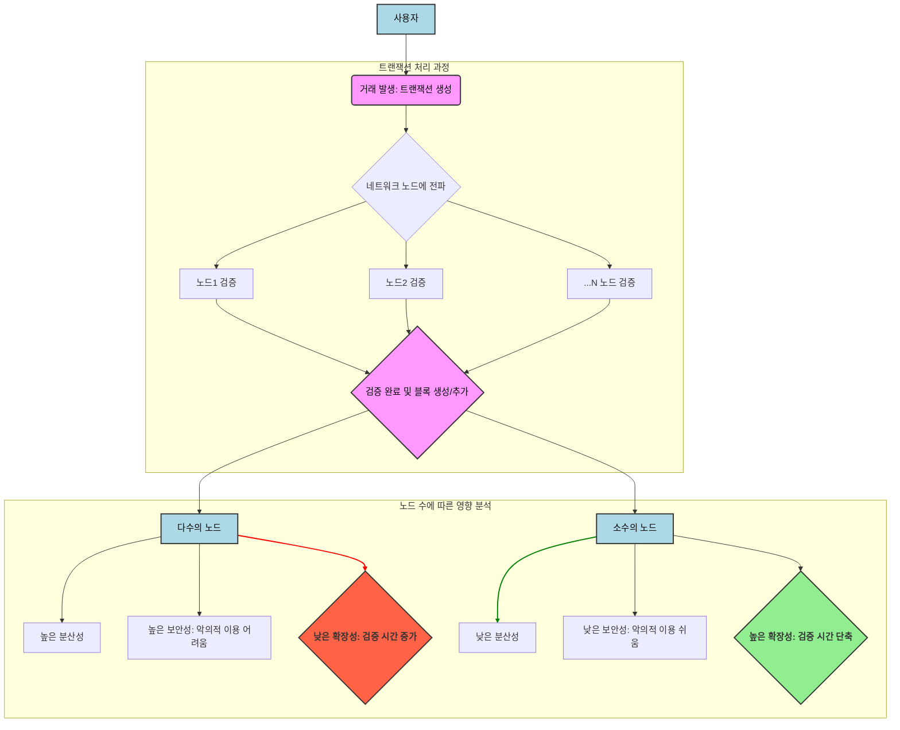

## 연관 문서

[BFT 발전 타임라인](https://devjzen.github.io/web3/2025/07/31/%EC%B5%9C%EC%8B%A0-BFT-%ED%94%84%EB%A1%9C%ED%86%A0%EC%BD%9C.html#h-1-%EC%B5%9C%EC%8B%A0-bft-%ED%94%84%EB%A1%9C%ED%86%A0%EC%BD%9C-%EC%A7%84%ED%99%94-%ED%83%80%EC%9E%84%EB%9D%BC%EC%9D%B8)

[실행 (Execution)](https://devjzen.github.io/web3/2025/07/29/2-%EC%8B%A4%ED%96%89.html)

---

> **블록체인**은 **분산된 합의 기반 트랜잭션 시스템의 근간을 형성하는 모델**이다.

블록체인의 역사는 1990년대 물리학자인 스튜어트 하버와 W. 스콧 스토네타가 어떻게 과거를 안전하게 지키고 디지털 정보를 안전하게 보호하고 변조를 방지할 수 있을지에 대한 고민으로 시작됐다.

사토시 나카모토가 2008년에 '비트코인: P2P 전자 화폐 시스템'이라는 논문을 발표하며 블록체인 기술이 상용화 되었다. 이 논문은 오늘날 가장 일반적으로 알려진 비트코인을 기술적으로 정의한 논문이다. 그래서 사람들이 비트코인을 블록체인 그 자체라고 오해하는 경우도 있다. 하지만 블록체인은 분산된 정보를 저장하는 기술이다. 2014년, 이더리움이 발표되었으며 이더리움은 EVM을 통해 혁신을 이뤘다.

[블록체인 ≠ 비트코인] 이 가장 중요한 개념이며, 암호화폐는 블록체인 기술로 구현된 것 뿐이다.

## 1. 블록체인

블록(데이터)들을 **P2P 방식(분산 방식)** 으로 체인 형태의 분산 데이터 저장 환경에 저장한 것을 블록체인이라고 부른다. 분산 시스템 모델이라고 봐도 좋다.

- 블록체인은 데이터의 무결성과 불변성을 보장하기 위해 **블록마다 해시 값을 저장**한다.

  - 쉽게 설명하면 해시 데이터는 제품의 로트넘버, 인체의 지문 등등 과 같은 고유한 값이다.
  - 해시 데이터는 동일한 데이터 생성이 매우 어렵도록 설계 되어있고 해시 충돌은 사실상 불가능에 가깝다. 이런 특성으로 인하여 불변성을 가진다.
  - 암호학적 연결은 분산 시스템에서 **정보의 신뢰성, 무결성, 가용성을 보장**하는 역할을 한다.
  - 이더리움의 세계 상태(world state)는 Merkle patricia 트리를 통해 관리되며, 이 트리의 루트 해시는 모든 내부 데이터에 암호학적으로 의존한다. 이는 상태의 보안 ID 역할을 하며, 불변성을 통해 이전 상태로 쉽게 돌아갈 수 있게 합니다.
- 블록체인 마다 다른 해시 암호화 기술을 채택하는 경우

  - 비트코인은 SHA-256을 사용하고 이더리움은 Keccak-256을 사용한다.
  - Keccak-256은 SHA-3 암호화 대회 최종 우승 알고리즘이었으며, FIPS 202로 표준화 되었지만 원래의 Keccak-256를 사용한다. 이 둘은 패딩 매개변수에서 미묘한 구현 차이로 인해 다른 해시 값을 생성한다.
  - EVM(이더리움 가상 머신)의 256비트워드 크기와 스택 항목 크기는 Keccack-256 해시 체계와 타원 곡선 연산을 위해 선택되었다.
- 분산 시스템의 개방성(openness)과 관리적 확장성(administrative scalability)

| 참여 및 접근 권한     | 허가 여부(Permission)          | 합의(Consensus)      | 설명                                                                                                                               |
| --------------------- | ------------------------------ | -------------------- | ---------------------------------------------------------------------------------------------------------------------------------- |
| 공개 (Public)         | 허가 필요 없음(Permissionless) | PoW, PoS             | 비트코인, 이더리움과 같은 공개형 모델들이 해당되며 특정 권한이나 허가 없이 모든 활동이 가능하다.                                   |
| 비공개 (Private)      | 허가 필요함(Permissioned)      | PoS, PoA             | Rinkeby는 블록이 신뢰할 수 있는 서명자에 의해서만 채굴되는 권한 증명 방식을 사용하는데, 신뢰할 수 있는 참여자들만 활동이 가능하다. |
| 컨소시엄 (Consortium) | 상황에 따라서 허가 필요함      | 공동의 의사결정 구조 | 컨소시엄 내의 참여 조직들이 공동으로 합의 메커니즘을 운영한다. 공동의 의사결정 구조를 가진다.                                      |

블록체인은 공개형으로 시작되었다. 기업과 기관들이 블록체인 기술을 도입하려 하면서 그들의 운영 방식과 거버넌스의 필요성에 따라서 '비공개'와 '컨소시엄'같은 모델들이 등장하게 되었다.

마스터링 이더리움에서는 "모든 블록체인이 똑같이 생성되지 않았다." 어떤 블록체인인지 이해하려면 개방형(open), 공개형(public), 전역형(global), 분산형(decentralized), 중립적(neutral), 검열 저항적(censorship-resistant) 같은 개방성과 관리적 확장성의 특성들을 명확히 해야 한다고 했다.

## 2. 블록과 노드, 트랜잭션

> 데이터의 상태를 변경은 트랜잭션을 통해 이루어지며 노드는 합의 참여자, 트랜잭션을 포함한 데이터의 단위를 블록이라고 한다.

이더리움에서의 트랜잭션은 상태 변화를 유발하는 '서명된 메시지'다. 예를 들어서, 한 계정이 다른 계정으로 이더를 전송하는 내용을 담을 수도 있고, 웹으로 생각하면 포스팅의 내용을 포함한다거나, 스마트 컨트랙트를 생성하거나, 스마트 컨트랙트의 함수를 호출하는 행위들이 모두 트랜잭션에 해당한다.

이더리움 옐로우 페이퍼에 따르면, 트랜잭션 `T`가 현재 상태 `σ`에서 실행되면, **새로운 상태 σ′를 생성**한다. 이는 `σ′ = Υ(σ, T)`로 형식적으로 정의된다. 여기서 `Υ`는 트랜잭션 평가 함수가 된다.

### 트랜잭션(Transactions)

> 트랜잭션은 두 상태 간의 '유효한 전환점'을 말한다.

 두 상태는 **트랜잭션 시작 전의 상태 (Initial State)** 과 **트랜잭션 완료 후의 상태 (Final State)** 를 의미한다.
	1. 시작 전의 상태는 데이터베이스 또는 시스템이 가지고 있는 **일관된 상태(good state)** 를 의미
	2. 트랜잭션 완료 후의 상태는 트랜잭션이 **모든 작업을 성공적으로 수행한 후** 데이터베이스가 도달하는 **새로운 일관된 상태**를 의미

- **ACID**의 속성을 지녔다.

| 속성               | 설명                                                                                                                                                               |
| ------------------- | ------------------------------------------------------------------------------------------------------------------------------------------------------------------ |
| 원자성(Atomicity)   | 트랜잭션 내에서 수행되는 모든 작업이 **완전히 성공하거나, 아니면 전부 실패하여 아무것도 변경되지 않거나 둘 중 하나여야 한다(all-or-nothing)**는 것을 보장하는 특성 |
| 일관성(Consistency) | 트랜잭션이 성공적으로 완료되면 데이터베이스가 **일관된 상태(good state)**에 있음을 보장하는 특성                                                                   |
| 고립성(Isolation)   | 여러 트랜잭션이 동시에 실행될 때**서로 간섭하지 않도록 보장**하는 특성                                                                                       |
| 내구성(Durability)  | 한번 커밋된 트랜잭션의 결과가 시스템 오류, 정전 또는 기타 예상치 못한 문제에도 불구하고 영구적으로 유지될 수 있도록 보장하는 특성                                  |

- 원자성
  1. **일관성 없는 상태 방지** 하는 것을 의미한다.
  2. 실행 오류로 실패한다면 모든 상태 변경(변수, 잔액 등)은 트랜잭션이 실행되지 않은 것처럼 '롤백'된다.
  3. 실패한 트랜잭션은 시도된 것으로 기록되고 가스 비용은 발신 계정에서 공제되지만 계약이나 계정 상태에는 영향이 없다.
  4. 분산 데이터베이스 시스템에서 **원자적 커밋(Atomic Commit)** 을 달성하기 위해 **2단계 커밋(Two-Phase Commit, 2PC)** 과 같은 프로토콜이 사용된다. 이 프로토콜은 코디네이터와 참여자 간의 두 단계(준비, 커밋)를 통해 모든 참여자가 트랜잭션을 커밋하거나 모두 중단하도록 보장한다.
- 일관성
  1. 트랜잭션을 통해서 유효한 상태 전환이 발생한다는 것은 일관성을 보장한다.
  2. ACID의 일관성은 **데이터베이스 자체의 속성이라기보다는 애플리케이션에 특화된 개념**으로, 데이터에 대한 특정 규칙이나 불변 속성(invariants)이 항상 참이어야 한다는 것을 의미한다.
- 고립성
  1. 트랜잭션 실행 실패 시 모든 상태 변경이 롤백되는 것은 트랜잭션이 완료되지 않으면 중간 상태가 영구적으로 반영되지 않도록 하여 어느 정도의 고립성을 보장한다.
  2. Cryptlets가 ACID 방식으로 분산 트랜잭션을 지원하여 사적인 진실 해상도를 가능하게 한다는 것은 다른 동시 트랜잭션으로부터의 영향을 제한하는 고립성의 개념을 의미한다.
- 내구성
  1. 결함이 있거나 악의적인 노드가 있더라도 트랜잭션은 진행되어야 한다.
  2. 트랜잭션이 성공적으로 완료되면 해당 변경 사항이 손실되지 않고 안전하게 보존됨(변경 된 상태의 good state)을 보장하다.
  3. 결함 허용 및 복원력 (Fault Tolerance and Resilience)

     1. 분산 시스템은 오류를 예측하고 이를 처리할 수 있도록 설계되어야 한다.
     2. 분산 시스템에서 오류가 발생하더라도 서비스가 올바르게 작동하도록 유지하는 방법을 찾는 것이 중요하다.

### 이더리움에서의 트랜잭션

- 스마트 컨트랙트의 상태 변경은 블록체인의 고유한 특성(불변성, 합의 알고리즘)과 **가스(Gas)** 메커니즘을 통해 내구성을 확보한다. 가스는 서비스 거부 공격을 방지하고 네트워크의 안정성을 유지하는 데 필수적이며, 이는 간접적으로 트랜잭션의 내구성에도 기여한다.
- 트랜잭션을 실행하려면 Gas가 필요하다.
- 필수 구성 요소: nonce, gasPrice, gasLimit, to, value, data(input), Signature
- Gas의 주요 역할은 자원 측정 및 제한, DoS 공격 방지, 경제적 인센티브, 우선순위 결정이다.
- 스냅샷 격리(Snapshot Isolation)는 트랜잭션이 데이터베이스의 일관된 스냅샷에서 읽도록 보장하며, MySQL과 PostgreSQL의 반복 읽기와 동일하다.
- 이더리움은 전체적으로 트랜잭션 기반의 상태 기계로 볼 수 있다. 제네시스 상태에서 시작하여 점진적으로 현재 상태로 변화시킨다. '현재' 상태가 이더리움 세계의 '정식'버전으로 간주된다.

트랜잭션의 개념을 먼저 파고 들었는데 합의에 대해서 이해하고 나면 트랜잭션이 더 알기 쉽다.

3. 합의 알고리즘과 매커니즘

> 합의 매커니즘이 합의 알고리즘을 포괄하는 개념이다.

두 단어가 혼용되는 경우가 많다. 단어의 경계가 유동적이지만 핵심은 여러 노드가 오류가 발생하더라도 어떤 값에 대해 동일하도록 보장하는 것이다. 더 쉽게 얘기하면 합의 알고리즘은 요리법(알리오올리오 레시피)과 같고 매커니즘은 요리 스타일(이탈리안 스타일)과 같다.

**합의 알고리즘(Consensus Algorithm)** 은 합의를 달성하기 위한 구체적인 절차와 규칙의 집합을 의미한다. 이는 '수학적으로 정의된 단계와 프로토콜'을 포함한다.

- 텐더민트(Tendermint, 지금의 CometBFT), 나라왈/불샤크(Narwhal/Bullshark), 핫스터프(HotStuff), 팍소스(Paxos), PBFT(Practical Byzntine Fault Tolerance)가 여기에 해당된다.

**합의 매커니즘(Consensus Mechanism)** 은 합의를 달성하기까지 사용되는 광범위한 원칙, 시스템, 또는 접근 방식을 지칭하는 경향이 있다. 알고리즘 뿐만아니라 기본적인 동기 부여, 인센티브, 자원 제어 방법을 포함할 수 있다.

- PoW과 PoS는 블록체인에서 합의를 달성하는 매커니즘으로 설명된다. 이러한 매커니즘을 통해 노드들이 합의에 참여하도록 유도한다.
- 이더리움의 Gas 또한 네트워크의 자원 남용을 방지하여 합의의 안정적인 달성을 지원하는 제어 매커니즘의 역할을 한다.

## 4. 블록체인의 문제점

> 블록체인이 중앙화의 문제를 해결한다면, 블록체인이 지닌 문제는 무엇일까?

블록체인이 풀어야할 숙제는 확장성, 탈중앙화(탈중앙성), 보안성을 완벽하게 구현해내는 것이다.
대부분의 블록체인은 세 가지 요소를 충족시키기 위해 각기 다른 기술을 구현하고 있다.

### 블록체인 트릴레마(Blockchain Trilemma)

이더리움 창시자인 비탈릭 부테린(Vitalik Buterin)이 2017년에 처음 제시한 개념으로 알려져 있다.

'블록체인 트릴레마'는 블록체인 기술이 직면한 근본적인 과제인 **분산성(Decentralization), 확장성(Scalability), 보안성(Security)이라는 세 가지 목표를 동시에 완벽하게 달성하기 어렵다**는 개념을 의미한다.
이 세 가지 요소 중 두 가지를 최적화하면 나머지를 '완벽하게' 달성하기 어려워진다.
그럼에도 돌파구는 있다.

- **분산성(Decentralization)** : 네트워크 접근 권한의 문제를 평가한다. 서로 다른 노드들이 합의를 통해 네트워크를 운영 및 관리할 수 있는지를 측정한다. 탈중앙성을 높이는 방법은 다양하지만, 일반적으로 네트워크의 검증에 참여하는 노드의 수가 많을수록 탈중앙성이 높다고 이야기합니다. 다양하게 분산된 노드의 수가 많을수록 단일 노드나 그룹의 네트워크에 미치는 영향이 줄어들기 때문입니다.
- **확장성(Scalability)** : 얼마나 많은 트랜잭션을, 얼마나 빠르게 처리할 수 있는지를 평가한다. 네트워크가 성장함에 따라 트랜잭션 또는 사용자 수를 효율적으로 처리할 수 있는 능력을 나타낸다. 높은 트랜잭션 처리량(Transaction Per Second)과 미래의 증가량이 확장성을 평가하는 기준이 됩니다. 높은 트랜잭션 처리량(TPS)은 초당 처리할 수 있는 트랜잭션 양으로, 쉽게 말해 ‘초당 얼마의 거래 건수를 처리할 수 있는지’를 의미한다.
- **보안성(Security)** : 네트워크에 대한 공격으로부터 블록체인에 기록된 정보 및 자산을 안전하게 지킬 수 있는지를 평가한다. 이더리움과 솔라나는 보안 감사팀인 Ackee와 협업하고 있다.

블록체인 네트워크에서 거래를 하기 위해서는 기본적으로 트랜잭션이 발생하고, 네트워크에 있는 노드에 전파한 후 검증하는 과정이 필요하다.

1. 노드가 많다는 것은, 검증에 참여하는 노드의 수가 많다는 것이고 네트워크 내부의 노드들이 서로 주고 받는 영향력이 낮아 분산성을 보장한다.
2. 노드가 많으면 상대적으로 거래를 악의적으로 이용하기 어려워져서 보안성이 높아진다.
3. 노드가 많으면 검증에 오랜 시간이 걸려서 확장성은 낮아진다.

#### 트랜잭션 처리 과정

확장성이 높다: 검증 시간이 줄어든다.
    노드의 수가 적어서 검증 시간이 단축된다. 속도 측면에서 빠르다.
    분산성과 보안을 보장하기 어렵다.

확장성이 낮다: 검증 시간이 오래 걸린다.
    노드의 수가 많다.
    상대적으로 분산성과 보안이 뛰어나다.

#### 비트코인의 트릴레마

**비트코인은 트릴레마의 세 요소 중 확장성을 양보한 네트워크**다.
비트코인은 시작부터 탈중앙화와 보안에 집중하였기 때문에 보안 측면에서는 최고의 암호화폐라 평가받고 있지만, **사용자 증가에 따라 자연스럽게 트랜잭션을 처리하는 속도가 느려지는 확장성 문제에 직면**하게 되었다. 이를 개선하기 위해 여러 가지 방법을 시도하였는데, 세그윗 업데이트와 라이트닝 네트워크가 한 예시다.

**세그윗은 블록에서 서명이 차지하고 있던 자리를 분리하여 블록당 담을 수 있는 트랜잭션 양을 증가시킨 업데이트**다. 블록의 크기는 이전과 같지만, 서명 데이터를 분리해 더 많은 트랜잭션을 담을 수 있어, 한 번에 많은 거래량을 처리할 수 있도록 한 것이다.

**라이트닝 네트워크는 비트코인 위에 구축된 오프 체인 거래 방식**이다. 확장성 문제로 비트코인이 실생활에서 결제 수단으로 사용될 수 없는 문제점을 해결하고자 제안됐다. 비트코인이 네트워크에서 발생하는 모든 전송 기록을 블록체인에 저장하는 반면 라이트닝 네트워크는 개별 거래를 별도의 채널에서 처리한 후 그 결괏값만 블록체인에 기록하는 특징을 가지고 있다. 즉, **중요 거래 기록만 블록에 저장하고 그 외 것들은 블록체인 밖에서 처리**하는 것이다. 이를 통해 **전송 속도를 대폭 향상하고 거래 수수료를 절감해 느리고 무거운 비트코인의 소액 결제를 가능**하게 했다.

그럼에도 비트코인은 여전히 결제 수단으로서 확장성은 부족하다고 평가받는다. 다른 체인들의 효율적인 확장성 확보 사례로 인한 상대성 때문이다.

#### 이더리움의 트릴레마

이더리움은 출시 당시에는 비트코인과 같은 **작업 증명 방식을 채택하여 네트워크를 운영**했다. 또한, **스마트 컨트랙트라는 프로그램을 추가하여, 이를 실행하기 위한 많은 리소스를 지속적으로 사용해야 하는 문제에 직면**했다.

이를 해결하기 위해 **가스비(Gas Fee) 방식의 수수료를 설정**했지만, **네트워크에서 채굴 노드가 많은 수수료를 받을 수 있는 높은 가스비 중심의 트랜잭션을 우선적으로 처리하는 문제가 발생**했다. 노드의 수가 증가할수록 수수료가 증가한다면 이더리움 네트워크가 성장하는 데 큰 문제가 될 수 있기에 합의 방식을 전환했다.

**2022년, 지분 증명(PoS) 합의 방식으로 전환**하고, 추후 롤업(Roll up)이라는 새로운 기술을 적용하여 확장성을 크게 개선할 업그레이드를 계획하고 있다.

#### 솔라나의 트릴레마

솔라나는 역사 증명(Proof of History, PoH)을 핵심 기반으로 삼아 확장성을 최우선으로 확보하면서도 강력한 보안과 점진적인 탈중앙화를 추구한다. 이러한 접근 방식은 높은 처리량과 낮은 거래 비용을 가능하게 하며, 동시에 위임 지분 증명(Delegated Proof of Stake, DPoS) 합의 메커니즘과 커뮤니티 프로그램을 통해 네트워크의 무결성을 보장하고 분산된 검증자 생태계를 육성한다. 솔라나의 주요 혁신으로는 PoH 외에도 **타워 BFT(Tower BFT), 걸프 스트림(Gulf Stream), 시레벨(Sealevel), 터빈(Turbine), 파이프라이닝(Pipelining)** 등이 있으며, 모든 구성 요소는 네트워크 성능을 최적화하기 위해 긴밀하게 협력한다.

#### 이오스의 트릴레마

이오스는 비트코인과는 다르게 **위임 지분 증명(DPoS) 방식의 합의 프로토콜을 선택한 네트워크**다. 위임 지분 증명(DPoS) 방식은 전체 코인 보유자들이 일정 수의 블록 생성자를 선출하고, 그들에게 블록 생성의 권한을 위임하는 방식으로 **비트코인에서 모든 노드가 합의하는 과정을 거치는 것과는 다른 방식**이다.

네트워크의 모든 노드가 아닌  **일부 노드가 블록 생성 과정을 담당하므로 블록 생성 시간이 단축되고, 트랜잭션 처리 속도는 높아졌지만 결국 탈중앙성을 만족시켰다고는 볼 수 없다** . 일부 선택된 노드가 블록체인을 운영하다 보니 그만큼 소수가 네트워크를 독점할 수 있는 위험이 높아지기 때문이다. 또한 소수의 노드를 공격하는 것은 분산된 다수의 노드를 공격하는 것에 비해 쉽기 때문에 보안의 위협도 받게 된다.

이오스는 확장성의 문제를 해결하는 데 초점을 맞춘 네트워크로, 이에 따라 탈중앙성과 보안성 측면을 양보했다고 볼 수 있다. 이로 인한 비판의 시각이 있다.

#### 트릴레마의 돌파구

블록체인 트릴레마 문제를 해결하기 위한 노력에는 합의 프로토콜 개선, 샤딩, 레이어2 블록체인을 들 수 있습니다.

- **합의 프로토콜 개선** : 이더리움은 확장성을 개선하고 보안성을 높이기 위해 합의 프로토콜을 작업 증명(PoW)에서 지분 증명(PoS)으로의 변경을 시도했다. 이를 통해 확장성 개선과 보안성 향상을 목표로 한다.
- **샤딩(sharding)** : 데이터베이스를 여러 조각으로 쪼개 관리하는 방법론으로써 블록체인에서는 흔히 트랜잭션을 더 작은 데이터로 나누어 처리하는 방식으로 확장성 개선을 목표로 하고 있다.
- **레이어 2 블록체인** : 기존 블록체인에 새로운 블록체인을 추가하여 기존 블록체인의 확장성을 개선하기 위한 방법이다.

이외에도 블록체인 트릴레마를 해결하기 위해 다양한 방법이 시도되고 있으며 세 가지 트릴레마 사이에서의 적당한 균형을 찾는 것을 목표로 삼고 있다.

참고: [블록체인 트릴레마 유래 및 기본 개념, 특징과 사례](https://www.codestates.com/blog/content/%EB%B8%94%EB%A1%9D%EC%B2%B4%EC%9D%B8-%ED%8A%B8%EB%A6%B4%EB%A0%88%EB%A7%88), [블록체인 트릴레마](https://m.upbitcare.com/academy/advice/379), [솔라나 스쿨 핸드북](https://ackee.xyz/solana/book/latest/chapter2/)

## 5. 블록체인 기술 구현 사례

- 비트코인
- 이더리움
- 코스모스
- 솔라나
- etc..

> [!info] Layer 1 blockchain?
> Layer 1은 데이터 계층, 기본 블록체인을 의미한다. 거래를 확인하고 실행하는 블록체인이다. 구현사례에 해당되는 블록체인은 전부 Layer 1에 속한다.
> Layer 2는 Layer 1 블록체인을 사용하거나 이를 위해 작동하는 모든 오픈체인 네트워크, 시스템 또는 기술, 기본 레이어 네트워크의 기능을 의미한다.
> Layer 3는 Layer 1, 2를 바탕으로 DApp에 대한 향상된 확장성, 상호 운용성 및 특수 기능을 제공한다.
