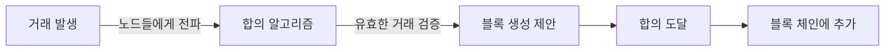

합의 계층에서 순서가 정해진 트랜잭션들을 실제로 처리(실행)하여 블록체인의 상태 (State)를 변경하는 부분이다. 비즈니스 로직이 일어나는 곳으로, 웹으로 말하자면 서비스 레이어와 같다.

블록체인에서의 실행이란 새로운 블록을 제안하고 다른 노드는 이를 실행하고 검증하는 단계이다. 이를 트랜잭션이라고 한다.

> 새로운 블록 제안 > 검증(합의) > 승인

# 1. 거래 제안 및 검증

노드는 거래가 포함된 새로운 블록을 제안하고, 다른 노드는 이를 다시 실행하고 일관성을 확인하여 거래를 검증한다.

# 2. 순차 실행 vs 병렬 실행

기존 블록체인 시스템은 블록 내에서 순차적으로 거래를 실행하지만, 병렬 실행 기술은 여러 거래를 동시에 실행하는 것을 목표로 한다.
Cosmos SDK는 Go 라는 언어의 특성을 살려서 병렬 실행 기술로 네트워크를 형성한다.

# 3. 거래 승인과 순서

작업 증명이나 지분 증명과 같은 합의 매커니즘은 모든 노드가 거래 순서와 결과 상태에 동의하도록 보장한다.

1. **거래 발생 및 전파**: 사용자가 거래를 생성하고 네트워크의 노드들에게 전파한다.
2. **유효성 검증**: 각 노드는 전파된 거래의 **유효성을 독립적으로 검증**한다. (예: 서명 확인, 잔액 확인, 이중 지불 여부).
3. **블록 생성 제안**: 합의 알고리즘에 따라 특정 노드(또는 노드 그룹)가 유효한 거래들을 모아 **새로운 블록을 생성**하고 네트워크에 제안한다.
4. **합의 도달**: 네트워크의 다른 노드들이 제안된 블록의 유효성을 검증하고, **합의 알고리즘에 따라 이 블록을 수락할지 여부를 결정**한다.
5. **블록 체인에 추가**: 대다수의 노드가 합의에 도달하면 해당 블록은 기존 블록체인에 추가되고, 블록 내의 거래들은 **최종적으로 승인**된다.

# 4. 실행 환경

- EVM
- SVM
- Cosmos EVM (evmOS)
