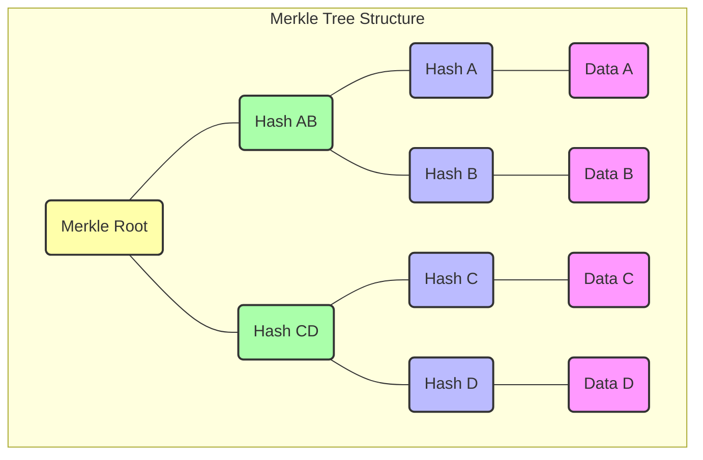

## 1. 개요

머클 트리는 분산 시스템, 특히 블록체인에서 **데이터의 효율적인 무결성 검증, 위변조 방지 및 간결한 데이터 증명**을 가능하게 하는 핵심적인 암호화 데이터 구조다.

## 2. 특성

머클 트리는 **리프(leaf) 노드와 비리프(non-leaf) 노드**로 구성된다.
트리 구조 최상단의 데이터를 머클 루트(Merkle Root)라고 일컫는다. 머클루트는 모든 해시데이터를 가지고 있다.
이와 같은 트리구조를 가지고 있어서 데이터의 무결성을 효율적으로 검증한다. 리프 노드가 변경되면 머클 루트까지 변경된다는게 중요하다.
